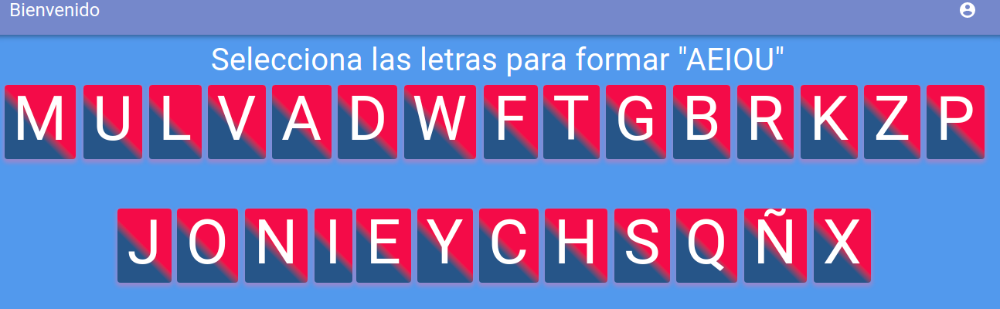

# Proyecto Fundación Alma Misionera AMI

This project was generated
- React
- Express

### Pre-Requisitos 📋

_Es necesario contar con las siguientes herramientas instaladas_

```
- nodejs
- mongodb
```
## Pasos a seguir

- Quitar ext .txt al archivo .evn.txt en la carpeta servidor
- Quitar ext .txt al archivo .evn.txt en la carpeta provin
- Configurar los valores necesarios en los archivos .env de las carpeta servidor y provin
- Ejecutar en la base mongo el siguiente script para generar el usuario por defecto

```
db.persons.insertOne( 
{
    "last_session":null,
    "token_session" : null,
    "active_session" : false,
    "name" : "xxxxxx xxxxxx",
    "email" : "xxxxx@xxxxxx.com",
    "password" : "$2b$12$l1Y3i13Lv1XDREz5AoB6yedsutGWYcnTMxvOPMtUf5DMXhWS4Qo6C",
    "__v" : NumberInt(0),
    "createdAt" : new Date(),
    "updatedAt" : new Date(),
    "is_admin" : true
    } )
```

- Usuario:???? Password:8800

## Servidor
- Puerto 4000
## Ejecutar el siguiente
- cd servidor
- npm install
- npm start


## Aplicacion
- Puerto 3000
## Ejecutar el siguiente
- cd servidor
- npm install
- npm start

## Login


## Pagina de registro


## Pagina de principal


## Menu de opciones


## Actividades





