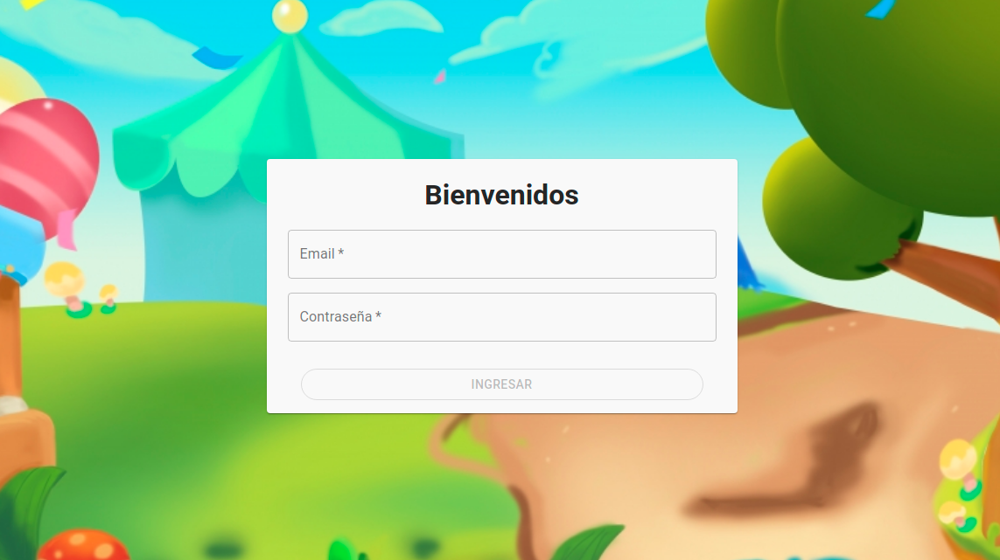

# Proyecto Fundación Alma Misionera AMI

This project was generated 

### Pre-requisitos 📋

_Es necesario contar con las siguientes herramientas instaladas_

```
- nodejs
- mongodb
```
## Pasos a seguir
- Quitar ext .txt al archivo .evn.txt en la carpeta servidor

## Servidor
## Ejecutar el siguiente

## Aplicacion
## Ejecutar el siguiente

 

## Login



## Pagina de registro


